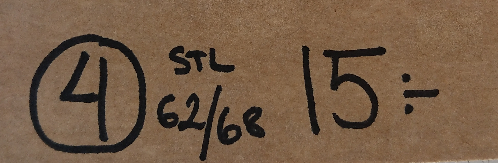
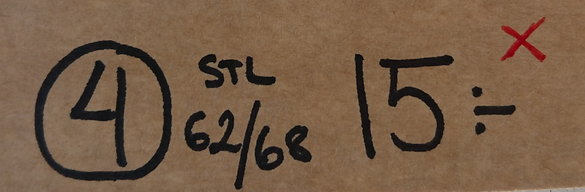

Här har vi samlat information som är specifik för dig som fått ett säljnummer och ska sälja kläder på vårt byte. Oavsett om du är ny eller rutinerad säljare så ber vi dig läsa igenom detta då vi kan ha uppdaterat riktlinjer och saker att tänka på.

**Det är väldigt viktigt för oss att det som säljs via oss håller god kvalité. Vi vill att det vi packar upp ska vara helt, tvättat och ordentligt rengjort, så att varorna säljs. Detta gäller både kläder, skor, leksaker och barngrejor.**

Tänk framförallt på att bytet på våren har fokus vår/sommar och bytet på hösten har fokus höst/vinter. Därför kommer vi exempelvis inte att ta emot pulkor och dunjackor på vårkanten, eller sommarklänningar och sommarsaker på höstbytet.

Vi sorterar bort sådant som anses osäljbart när vi packar upp, men även under dagen när försäljning sker. Sådant som sorteras bort är fläckigt, trasigt, smutsigt, otvättat, ofräscht, slitet, och det gäller både kläder, skor och leksaker.

**Tänk på att:** det inte är okej att märka ut eventuella hål eller smutsfläckar på kläderna — det lämnar du direkt till textilåtervinning, inte till oss. Inlämning av osäljbart kan leda till att du inte får sälja hos oss igen!

## Vad får jag lämna in?

- Barnkläder storlek 74cl–176cl (XXS–S)
- Tonårskläder i stl S–L — dock inte vuxenkläder, utan kläder som din ungdom faktiskt haft på sig
- Utklädningskläder, morgonrockar, sportkläder, ytterkläder för säsong
- Barnskor
- Vagnar, cyklar, pulkor, skidor, skateboard, sportutrustning etc. för säsong
- Leksaker, pyssel, spel, böcker
- Barnartiklar såsom lakan, pottor m.m.

## Hur mycket får jag lämna in?

- Max **fyra** papperskassar med kläder och leksaker, samt **en** papperskasse med skor. Vi tar inte emot andra typer av kassar, t.ex. IKEA-påsar eller liknande — välj med fördel påsar från butiker som har stora papperskassar
- Max **tio** par skor
- Max **fem** gosedjur — välj med fördel sådana av bättre kvalitet, inte sådana som vunnits i spelautomater då dessa oftast inte säljs
- Vagnar, cyklar och liknande (skrymmande saker) räknas utöver papperskassarna

## Vilket skick gäller?

Kläder och skor som du lämnar in ska vara **hela, fräscha, moderna och tvättade**.

## Vad får jag inte lämna in?

- Vuxenkläder
- VHS eller äldre DVD, då dessa nuförtiden säljer dåligt
- Pyssel som är använt, t.ex. målarböcker där hälften av sidorna målats på, trasiga pennor, torra tuschpennor osv.
- Kläder som ska skänkas direkt till välgörenhet
- Bilbarnstolar, cykelhjälmar och flytvästar äldre än 6 år — materialet bryts ned och förlorar sin funktionalitet

## Så här sorterar du kläderna innan du lämnar in dem

- Sortera kläderna efter storlek och lägg dem storleksvis i plastpåsar. Det ska vara en storlek i varje plastpåse (d.v.s. 74/80 i en, 86/92 i en annan o.s.v.)
- Regnkläder, sportkläder, badkläder, badrockar, mössor och vantar läggs i egna plastpåsar, eftersom de sorteras upp på separata bord. Sortera efter smått (74–128 cl) och stort (134–176 cl)
- Märk plastpåsen **tydligt** på utsidan med den storlek/sort som ligger i
- Knyt inte påsarna!
- Lägg plastpåsarna i de papperskassar som får lämnas in

## Så här sorterar du andra saker du lämnar in

**Tänk på att underlätta uppackningen genom att sortera noga:**

Skor, böcker, spel, leksaker, utklädningskläder och inredning ska vara i foajén — sortera i olika plastpåsar och märk dem tydligt så att det blir enkelt att lägga påsarna på respektive station: böcker i en, utklädning i en, leksaker i en, och så vidare.

**Leksaker sorteras efter kategori. De vi använder är:**

- **Dockor** – dockor, barbies, actionfigurer, smågubbar, docktillbehör osv.
- **Bygg** – Lego, Duplo, PlusPlus, kapplastavar, klossar osv.
- **Hushåll/Instrument** – leksaksmat, "hushållsutrustning", instrument osv.
- **Fordon** – småbilar, större plastbilar, motorcyklar osv.
- **Djur** – dinosaurer, My Little Pony osv.
- **Pyssel** – pärlor, pyssel, ritböcker, pennor, papper osv.
- **Små barn** – blandade bebisleksaker, träleksaker, skallror osv.

## Så här ska du märka dina varor

Vi kan inte nog poängtera hur viktigt det är att alla varor märks på rätt sätt. Att märka rätt är viktigt för att du som säljare ska få rätt betalt för det som sålts, och för att det du inte sålt ska returneras till just dig.

- Märk **allt** du lämnar in med maskeringstejp (testa så att den sitter bra och inte skadar varan när den tas av)
- En etikett/lapp ska vara max 7 cm lång
- Etiketten ska innehålla: **säljnummer** (inringat), **storlek** och **pris**, i exakt den ordningen

*Så här ska en korrekt etikett/lapp se ut*

- Minsta möjliga pris är 5 kr. Därefter gäller jämna femtal, d.v.s. 10, 15, 20, 25 kr o.s.v.
- Sätt tejpen utanpå plagget så att man lätt ser den. Om du märker varor där tejpen fastnar, lägg varan i en plastpåse så att den inte förstörs när vi river av etiketten i kassan
- Plastpåsar märker du genom att först sätta en bit tejp på påsen och sedan ytterligare en lite kortare tejpbit ovanpå den första, med säljnummer, storlek och pris
- Vi accepterar inga ändringar på etiketterna. Vill du ändra priset, gör en ny etikett — ser vi en ändrad etikett i kassan säljer vi inte varan, eftersom vi inte vet vem som ändrat
- Flerdelade plagg/varor: skor måste hållas ihop med ett snöre som träs genom t.ex. skosnörshålen. Kläder som är tvådelade måste fästas ihop noga för att de inte ska försvinna från varandra (och därmed bli osäljbara)
- Skor är lättare att sälja om de är tydligt storleksmärkta. Skriv gärna en extra lapp med storleken och fäst på sidan av skon (utöver den vanliga etiketten)

## Skänk bort det som ej blir sålt

Du kan välja att skänka osålda varor till välgörenhet (Söderledskyrkan, Human Bridge och liknande). Märk i så fall din etikett med ett rött kryss, X, som bilden nedan visar. Skänk inga vagnar, cyklar eller andra skrymmande saker.

*Notera det röda krysset*

## Övrigt

Vi är inte försäkrade, så all inlämning sker på egen risk. Stölder förekommer tyvärr, så vi avråder från att lämna in alltför värdefulla saker — då är t.ex. Blocket eller Marketplace ett säkrare alternativ.

Vi tar ut en avgift på 25 % av försäljningen för omkostnader. Om du, mot förmodan, inte kan sälja behöver du lämna besked om det senast en vecka innan bytet. Senare avbokning än så, oavsett orsak, innebär att du stryks från vår mejllista och inte får sälja kläder genom oss igen.


